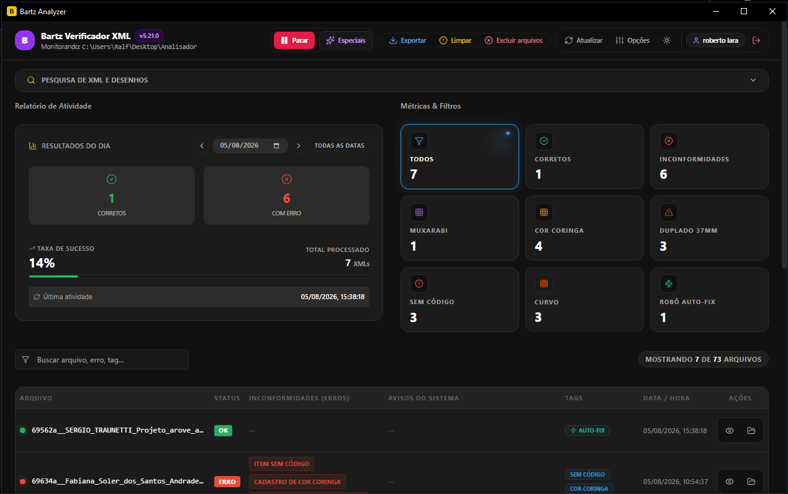
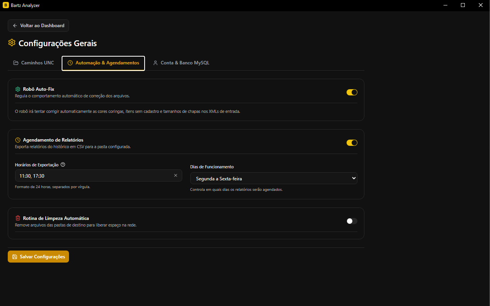
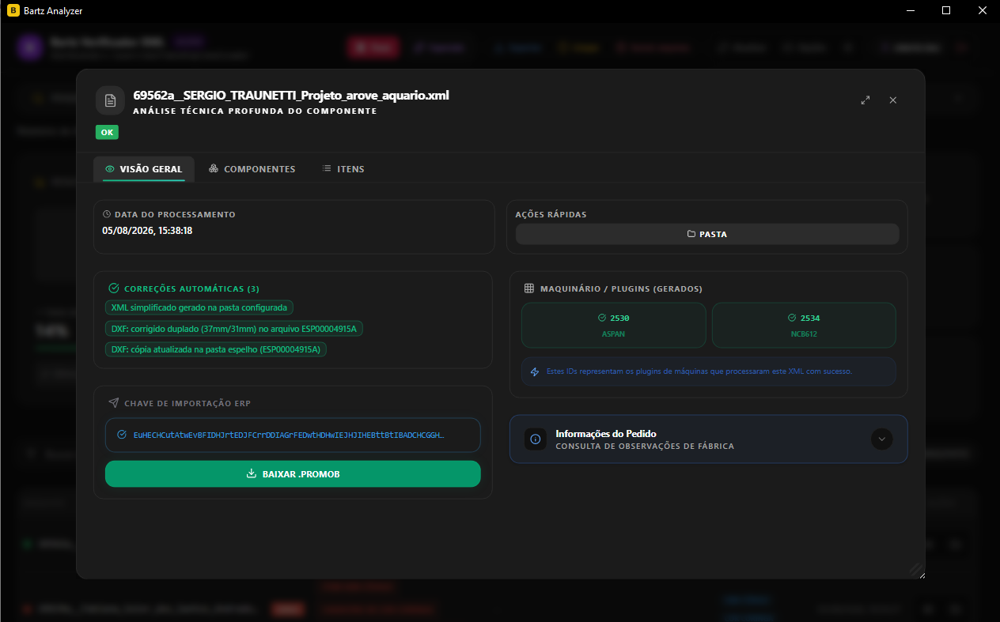
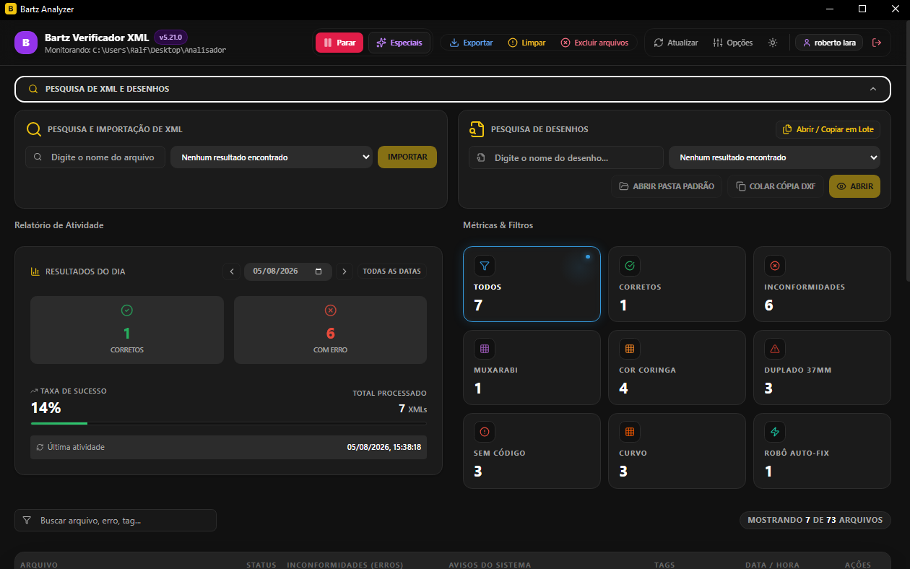
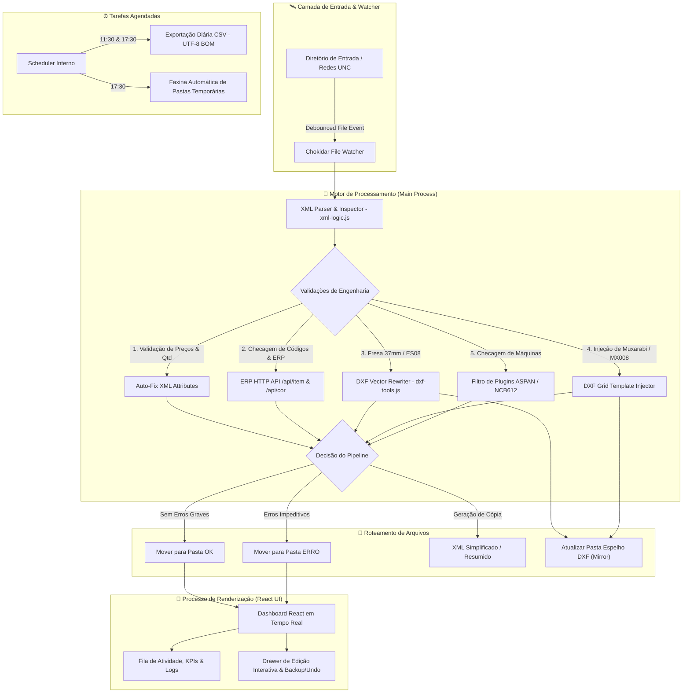

<div align="center">

# 🏗️ Bartz Analyzer

### Sistema Industrial de Monitoramento, Validação de Engenharia e Auto-Fix de XML/DXF para Produção CNC

[](https://nodejs.org/)
[](https://www.electronjs.org/)
[](https://react.dev/)
[](https://www.typescriptlang.org/)
[](https://tailwindcss.com/)
[](https://vitejs.dev/)
[](https://vitest.dev/)
[](https://www.docker.com/)

---

*Uma solução robusta de engenharia de software aplicada ao chão de fábrica, desenvolvida para eliminar gargalos de produção, impedir perda de matéria-prima e automatizar a correção de arquivos de usinagem CNC.*

</div>

---

## 📸 Preview da Interface

<div align="center">
  
  
  
  
</div>

---

## 📌 Resumo Executivo & Contexto de Negócio

No ecossistema fabril da **Bartz Móveis Planejados**, os projetos elaborados pelos projetistas no software **Promob** são exportados em formato **XML** e direcionados diretamente para o maquinário CNC de alta precisão (como furadeiras e seccionadoras **ASPAN** e **NCB612**).

Inconsistências em arquivos exportados (como furações de 37mm descalibradas, ausência de código de peças, cores coringa não substituídas ou falhas na estrutura de sub-itens) historicamente geravam **interrupções na linha de produção**, **quebra de ferramentas de usinagem** e **desperdício de chapas de MDF/MDP**.

O **Bartz Analyzer** é uma aplicação **Desktop Cross-Platform de Missão Crítica** que atua como uma sentinela autônoma de monitoramento de rede. Ele inspeciona, valida contra APIs de ERP corporativo, gera relatórios analíticos e **executa correções automáticas (Auto-Fix) diretamente na estrutura de tags do XML e em arquivos vetoriais CAD (.DXF)** antes que os arquivos cheguem ao chão de fábrica.

---

## ⚙️ Arquitetura de Software & Design Patterns

A aplicação foi projetada seguindo padrões modernos de arquitetura de software Desktop, garantindo **segurança de processos, alta disponibilidade e desacoplamento de responsabilidades**.



### 🏢 Modelo Multi-Processo (Electron IPC Architecture)

* **Processo Principal (Main Process - Node.js):** Executa o daemon de monitoramento (`chokidar`), manipulação de arquivos no SO, parsing AST de XMLs com `fast-xml-parser`, reescrita binária/vetorial de arquivos CAD DXF, rotinas de backup, agendamento de relatórios e requisições HTTP para as APIs do ERP.
* **Processo de Renderização (Renderer Process - React 18):** Interface SPA reativa construída com TypeScript e Tailwind CSS. Exibe o estado em tempo real da fila de produção, dashboards de métricas (KPIs), busca avançada e drawer de inspeção detalhada de pedidos.
* **Preload Bridge (`preload.js`):** Camada de isolamento de contexto (`contextBridge`) que expõe uma API fortemente tipada (`window.electron.analyzer`, `window.electron.settings`, `window.electron.updater`) via IPC (`ipcRenderer.invoke` / `ipcRenderer.on`), garantindo que a UI não possua acesso direto ao Node.js nativo (cumprindo os mais rígidos padrões de segurança do Electron).

---

## ⚡ Funcionalidades Principais em Detalhes

### 1. 🛰️ Monitoramento Ativo em Tempo Real (File System Watcher)
* **Daemon Chokidar:** Observa diretórios locais ou compartilhamentos de rede Windows (`UNC / SMB` como `\\192.168.1.10\Promob`).
* **Debounce & Queue Management:** Lida de forma resiliente com arquivos em processo de escrita ou travados por outros sistemas.
* **Processamento One-Shot:** Botão na interface para escaneamento sob demanda da pasta de entrada sem necessidade de reiniciar o watcher.

---

### 2. 🔬 Motor de Validação de Engenharia de Produção

O sistema realiza inspeções profundas na estrutura XML de cada pedido de produção:

| Validação | Código / Tag | Ação do Sistema | Impacto Evitado |
| :--- | :--- | :--- | :--- |
| **Itens sem Código** | `REFERENCIA=""` / `ITEM_BASE=""` | Flag de Erro Impeditivo (`SEM CÓDIGO`) + Destaque no Drawer | Paralisação da CNC por falta de especificação de usinagem. |
| **Itens Sem Preço/Qtd** | `PRECO_TOTAL="0"` / `QUANTIDADE="0"` | Flag de Alerta / Correção via Auto-Fix | Inconsistência no faturamento e falha no envio de insumos. |
| **Item Duplado 37mm** | `ITEM_BASE="ES08"` | Alerta `DUPLADO 37MM` + Sugestão de Auto-Fix de DXF | Quebra de broca de 31mm em usinagem projetada para 37mm. |
| **Cores Coringa** | `PAINEL_CG1_18`, `FITA_CG2_22`, etc. | Alerta `COR CORINGA` + Tela de substituição em lote | Produção de móveis com chapas em cores genéricas incorretas. |
| **Peça Muxarabi** | `ITEM_BASE="MX008..."` | Alerta `MUXARABI` + Injeção automática de malha 2D no DXF | Peças vazadas sem o desenho de usinagem em grade. |
| **Sem Item Filho** | Top-level `<ITEM>` sem sub-tags | Alerta `SEM ITEM FILHO` + Opção de remoção da estrutura vazia | Envio de componentes vazios que causam erro no software da máquina. |
| **Plugins de Máquinas** | Máquinas `2530` (ASPAN) / `2534` (NCB) | Validação da presença dos parâmetros de máquina no XML | Envio de pedidos para máquinas descalibradas ou incompatíveis. |
| **Consulta ERP Integrada** | Validação REST via HTTP API | Cruzamento de itens com o catálogo do ERP corporativo | Inclusão de itens descontinuados ou sem cadastro de estoque. |

---

### 3. 🤖 Auto-Fix Inteligente (Correção Automática de XML & DXF)

O **Bartz Analyzer** não é apenas um validador passivo; ele possui **motores de auto-reparo** capazes de modificar os arquivos em tempo de execução:

#### 🛠️ Auto-Fix em XML:
* **Preços e Quantidades:** Ajusta automaticamente quantidades zero para `1` e preços zero para `R$ 0,10` quando ativado nas opções.
* **Limpeza de Estrutura Vazia:** Remove nós pai de `<ITEM>` que não possuem furações ou componentes filhos (`Sem Item Filho`), sanitizando a estrutura XML.

#### 📐 Auto-Fix em DXF (Reescrita de Geometria Vetorial CAD):
* **Correção de Fresa 37mm -> 18mm (`ES08`):** O módulo `dxf-tools.js` analisa o arquivo `.dxf` da peça na pasta de desenhos, localiza na seção `ENTITIES` os blocos de usinagem de duplado e reescreve a profundidade e diâmetro da ferramenta de 37mm/31mm para o padrão de 18mm.
* **Injeção Automática de Muxarabi (`MX008`):** Identifica as dimensões da peça (ex: 25x25, 40x25) e a espessura (18mm, 25mm), injetando a malha de usinagem de grade DXF diretamente na layer de usinagem da peça, sem intervenção humana de um desenhista CAD.
* **Sincronização com Pasta Espelho (Mirror Sync):** Após a modificação do arquivo DXF pelo robô, uma cópia atualizada é automaticamente enviada para a pasta espelho da fábrica, garantindo que o operador da máquina leia o arquivo corrigido.

---

### 4. 🎨 Drawer de Inspeção Detalhada & Edição Interativa

Ao clicar em qualquer pedido na interface React, um **Drawer interativo de alta produtividade** é exibido com abas especializadas:

* **Abas de Engenharia:**
  * **Cores Coringa:** Permite a substituição em lote de siglas (`CG1` / `CG2` / `CORINGA1`) por cores reais registradas no ERP.
  * **Sistema de Backup & Undo:** Toda substituição de cor gera um backup em disco do XML original, permitindo desfazer a alteração com 1 clique (`undoReplace`).
  * **Itens do Pedido:** Tabela completa listing itens pai e filho, com edição de descrição em tempo real e re-associação de arquivos de desenho (`DESENHO`).
  * **Pesquisa de Produtos ERP:** Modal integrado de busca no ERP corporativo por código ou descrição para inserção direta no pedido.
  * **Lote de Pedidos de Compra (PO):** Filtragem e exibição isolada de itens de formato `POXXXXXX`.
  * **Muxarabi & Desenhos Especiais:** Visualizador e acionador direto dos desenhos DXF no software CAD padrão do sistema operacional.

---

### 5. 🔍 Busca Global em Lote & Gerenciador de Desenhos (`BatchDrawingsModal`)

* **Localizador de Desenhos & XMLs:** Modal na interface que realiza buscas recursivas em pastas de rede por termo de pesquisa.
* **Cópia para Pasta Espelho:** Permite selecionar dezenas de arquivos DXF e copiá-los em lote para a pasta espelho da produção.
* **Re-injeção de Pedidos:** Permite copiar XMLs antigos localizados na rede diretamente para a pasta de entrada do robô para novo processamento.

---

### 6. ⏰ Agendador de Tarefas & Relatórios Diários (Scheduler)

* **Relatórios Diários Automatizados:** O motor `reports-scheduler.js` gera automaticamente às **11:30** e **17:30** relatórios completos em formato **CSV** na pasta de relatórios.
* **Compatibilidade nativa com Excel (UTF-8 BOM):** Arquivos salvos com marca d'água de bytes `\uFEFF` para abertura direta no Microsoft Excel sem corrupção de acentuação.
* **Limpeza Programada de Pastas:** Rotina autônoma executada diariamente às **17:30** que limpa logs e arquivos temporários das pastas `ok`, `erro`, `log_proc` e `log_erro`, mantendo o servidor otimizado.
* **Seletor por Calendário UI:** Calendário nativo na interface para filtragem de histórico e exportação manual de relatórios de datas passadas.

---

### 7. 🔄 Atualização Automática OTA (Over-The-Air)

* **Integração com GitHub Releases:** Módulo `updater.js` integrado ao `electron-updater`.
* **Download Silencioso e Progresso Visual:** A aplicação checa periodicamente por novas versões publicadas no repositório GitHub, exibe barra de progresso de download na interface e permite a instalação e reinício com 1 clique.

---

## 🏛️ Estrutura do Código Fonte

```
📦 Bartz-Analyzer
 ├── 🖥️ cjs-main.js                  # Arquivo de entrada do Processo Principal (Main Process Electron)
 ├── 🖥️ preload.js                   # Ponte IPC de segurança (contextBridge) entre Main e Renderer
 ├── 🖥️ watcher.js                   # Entry-point secundário de monitoramento
 ├── 🖥️ report-scheduler.js          # Agendador de tarefas independente
 ├── 📂 main/                        # Módulos Core do Processo Principal (Node.js)
 │    ├── 🛠️ dxf-tools.js            # Parser DXF, Injeção de Muxarabi & Correção de Fresa 37mm
 │    ├── 🔐 erp-auth.js             # Autenticação e tokens da API ERP corporativa
 │    ├── 🔎 erp-search.js           # Consulta de produtos/cores na API ERP e arquivos CSV
 │    ├── 🛡️ erp-validation.js       # Validação de integridade de itens do pedido com ERP
 │    ├── 🧰 helpers.js              # Funções utilitárias de I/O, resolução de caminhos UNC e IPC
 │    ├── 📜 history.js              # Gerenciador de histórico de processamento persistente (JSON)
 │    ├── ⏰ reports-scheduler.js     # Motor cron agendador de relatórios CSV e faxina de pastas
 │    ├── ⚙️ settings.js             # Gerenciamento de configurações armazenadas via electron-store
 │    ├── 🧠 state.js                # Estado global em memória do processo principal
 │    ├── 🔄 updater.js              # Integração de atualizações OTA com GitHub Releases
 │    ├── 👁️ watcher.js              # Monitoramento de sistema de arquivos com Chokidar
 │    ├── 📝 xml-editor.js           # Edição de XML: troca de coringas, referências, backup e undo
 │    └── ⚡ xml-processor.js        # Pipeline central: validação, geração de simplificado e auto-fix
 ├── 📂 src/                         # Processo de Renderização (Interface React 18 + Vite)
 │    ├── 🧩 components/             # Componentes modulares da Interface
 │    │    ├── 📊 Dashboard.tsx      # Dashboard principal (KPIs, Fila de Arquivos, Filtros e Busca)
 │    │    ├── ⚙️ ConfigurationScreen.tsx # Painel de Opções, Diretórios e Teste de Pastas de Rede
 │    │    ├── 📂 FileDetailDrawer.tsx# Drawer deslizante de detalhes do pedido
 │    │    ├── 🔍 BatchDrawingsModal.tsx # Modal de busca e cópia em lote de arquivos CAD e XMLs
 │    │    ├── 📈 ProcessingStats.tsx# Cards de métricas de engajamento e erros
 │    │    ├── 🏷️ AutoFixBadge.tsx   # Badges indicativos de correções efetuadas pelo robô
 │    │    ├── 🏷️ BadgeErro.tsx      # Badges com estilo e severidade de inconformidades
 │    │    └── 🗂️ drawer/            # Abas especializadas do Drawer (Coringa, Muxarabi, ES08, etc)
 │    ├── ⚓ hooks/                  # Custom React Hooks (IPC Communication & Store)
 │    ├── 🛠️ lib/                    # Lógica utilitária compartilhada
 │    │    └── 🧪 xml-logic.js       # Regras puras de parsing e validação de XML (testável)
 │    └── 🏷️ types/                  # Definições de Tipos TypeScript (Interfaces Globais)
 ├── 📂 Muxarabi/                    # Biblioteca de gabaritos vetoriais DXF por dimensão/espessura
 ├── 🧪 tests/                       # Testes unitários da lógica de parsing e validação XML (Vitest)
 ├── 🐳 Dockerfile                   # Configuração de container Linux para builds e testes CI/CD
 └── 🐳 docker-compose.yml           # Orquestração do container de desenvolvimento/testes
```

---

## 💻 Instalação & Desenvolvimento

### Pré-requisitos

* **Node.js** `v20.0.0` ou superior
* **npm** `v10.0.0` ou superior

### Passos para Execução Local

```bash
# 1. Clonar o repositório
git clone https://github.com/betolara1/Bartz-Analyzer-4.git
cd Bartz-Analyzer

# 2. Instalar as dependências do projeto
npm install

# 3. Iniciar o ambiente de desenvolvimento (React Vite + Electron em paralelo)
npm run dev
```

> **Nota:** O script `npm run dev` utiliza `concurrently` para subir o servidor Vite na porta `5174` e, em seguida, dispara o Electron apontando para o ambiente de desenvolvimento com Hot Reload.

---

## 📦 Como Gerar o Executável de Produção (.exe)

A aplicação utiliza `electron-builder` pré-configurado para gerar instaladores autônomos para **Windows (NSIS)**.

```bash
# Compilar o código React e gerar o instalador de produção em /release
npm run dist:win
```

### O que o processo de build realiza:
1. Executa `vite build` compilando a UI otimizada para a pasta `/dist`.
2. Empacota a aplicação incluindo os recursos extras (pasta `Muxarabi/`).
3. Gera o instalador **`Bartz-Analyzer-Setup-x.x.x.exe`** dentro do diretório **`release/`** com suporte a instalação personalizada, atalho na Área de Trabalho e Menu Iniciar.

---

## 🧪 Suíte de Testes Unitários

A integridade das regras de negócio e do parser de XML é garantida por testes unitários escritos com **Vitest**.

```bash
# Executar a suíte de testes unitários
npm test
```

Os testes cobrem:
* Parsing de tags de pedidos e identificação de atributos ausentes.
* Detecção de itens `ES08` (duplado 37mm) e `MX008` (Muxarabi).
* Validação de regras de substituição de cores coringa (`CG1`/`CG2`).
* Validação de geração de XML simplificado.

---

## 🐳 Execução via Docker (Containerização)

O projeto conta com suporte completo a containerização Docker com dependências GTK/X11 preparadas para testes headless e ambientes de integração contínua (CI/CD).

```bash
# Subir o ambiente containerizado via Docker Compose
docker-compose up --build
```

---

## 🛠️ Stack Tecnológica

| Categoria | Tecnologia | Versão | Aplicação |
| :--- | :--- | :--- | :--- |
| **Runtime Desktop** | **Electron** | `^37.3.1` | Execução nativa multi-processo Cross-Platform |
| **UI Framework** | **React** | `^18.2.0` | Interface componentizada e reativa |
| **Linguagem** | **TypeScript** | `^5.9.2` | Tipagem estática rigorosa no Renderer e IPC |
| **Bundler & Build Tool** | **Vite** | `^7.3.1` | Compilação ultrarrápida do frontend e HMR |
| **Estilização** | **Tailwind CSS** | `^3.4.17` | Sistema de design utility-first responsivo |
| **Componentes UI** | **Radix UI** | `^1.1.0` | Primitivos acessíveis (Dialog, Tooltip, Select, Dropdown) |
| **Monitoramento I/O** | **Chokidar** | `^4.0.3` | Watcher de sistema de arquivos de alta performance |
| **Parser XML** | **fast-xml-parser** | `^5.2.5` | Parsing bidirecional de alta velocidade de documentos XML |
| **Manipulação DXF** | **dxf-parser / Custom** | `^1.1.2` | Leitura e reescrita de entidades vetoriais CAD |
| **Banco de Dados Local**| **Electron Store** | `^11.0.2` | Persistência de configurações e preferências do usuário |
| **Atualizador OTA** | **Electron Updater** | `^6.8.9` | Atualizações automáticas de versão via GitHub Releases |
| **Testes Unitários** | **Vitest** | `^3.2.4` | Runner de testes moderno e rápido baseado em ESM |

---

## 👨‍💻 Autor & Engenharia de Desenvolvimento

Desenvolvido por **Beto Lara** — *Backend & Desktop Software Engineer*

[](https://github.com/betolara1)

---

<div align="center">

**Bartz Analyzer** — *Engenharia de Software de Alta Performance Garantindo a Continuidade e Precisão do Chão de Fábrica.*

> **Nota:** Este projeto utiliza o agente de inteligência artificial **Antigravity** (Google DeepMind) para aceleração de desenvolvimento, arquitetura de sistemas, refinamento estético de interface e garantia de conformidade com boas práticas de engenharia de software.

</div>
